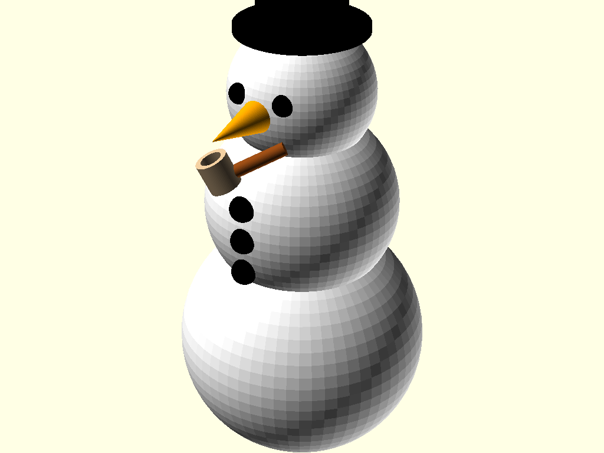

# Snowman - Colloquial CAD Test

This project was a test of one-shot colloquial CAD using image analysis for verification.

## The Experiment

The goal was to generate an OpenSCAD 3D model from a natural language description, render it to PNG, and use image analysis to verify correctness - all in a single pass.

## What Happened

The initial prompt requested a snowman with:
- Three z-aligned intersecting spheres (body, chest, head)
- A stovepipe hat (two cylinders)
- A cone nose
- Hemisphere eyes and buttons

This was successfully generated and verified in one shot.

However, when a corn-cob pipe was requested to be added "held jauntily," the specification was inadequate. The initial implementation had the pipe oriented backwards (stem pointing outward, bowl near the face). A follow-up correction was needed to properly orient the pipe with the stem extending from the mouth to the bowl.

## Result

**One-shot became two-shot** due to the ambiguous "held jauntily" specification for the pipe. The phrase didn't adequately convey the expected orientation of stem-to-bowl relative to the face.

## Files

- `snowman.scad` - OpenSCAD source code
- `snowman.png` - Rendered output
- `claude_conversation.md` - Full conversation log
